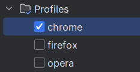

# Maven Profiles 

##### Run tests 

All tests:

Click on browser

Which browser is selected on such browser a test is start.

##### About Profiles

##### Click 2 browser
If you click on two browsers, the test that you clicked on last will be recorded.

##### Don't click browser

If you don't click browser test won't start.

##### Warning

If browser has an update , then the test may not run on this browser.

java.lang.IllegalArgumentException: Class not found: opera

	at com.codeborne.selenide.webdriver.DefaultDriverFactory.classOf(DefaultDriverFactory.java:69)
	at com.codeborne.selenide.webdriver.DefaultDriverFactory.createInstanceOf(DefaultDriverFactory.java:33)
	at com.codeborne.selenide.webdriver.DefaultDriverFactory.create(DefaultDriverFactory.java:26)
	at com.codeborne.selenide.webdriver.WebDriverFactory.createWebDriverInstance(WebDriverFactory.java:117)
	at com.codeborne.selenide.webdriver.WebDriverFactory.createWebDriver(WebDriverFactory.java:67)
	at com.codeborne.selenide.drivercommands.CreateDriverCommand.lambda$createDriver$0(CreateDriverCommand.java:72)
	at com.codeborne.selenide.logevents.SelenideLogger.wrap(SelenideLogger.java:133)
	at com.codeborne.selenide.logevents.SelenideLogger.get(SelenideLogger.java:113)
	at com.codeborne.selenide.drivercommands.CreateDriverCommand.createDriver(CreateDriverCommand.java:48)
	at com.codeborne.selenide.impl.WebDriverThreadLocalContainer.createDriver(WebDriverThreadLocalContainer.java:189)
	at com.codeborne.selenide.impl.WebDriverThreadLocalContainer.createAndRegisterDriver(WebDriverThreadLocalContainer.java:174)
	at com.codeborne.selenide.impl.WebDriverThreadLocalContainer.getAndCheckWebDriver(WebDriverThreadLocalContainer.java:136)
	at com.codeborne.selenide.WebDriverRunner.getAndCheckWebDriver(WebDriverRunner.java:113)
	at com.codeborne.selenide.impl.StaticDriver.getAndCheckWebDriver(StaticDriver.java:65)
	at com.codeborne.selenide.SelenideDriver.getAndCheckWebDriver(SelenideDriver.java:213)
	at com.codeborne.selenide.drivercommands.Navigator.lambda$navigateTo$0(Navigator.java:71)
	at com.codeborne.selenide.logevents.SelenideLogger.lambda$run$0(SelenideLogger.java:105)
	at com.codeborne.selenide.logevents.SelenideLogger.wrap(SelenideLogger.java:133)
	at com.codeborne.selenide.logevents.SelenideLogger.run(SelenideLogger.java:104)
	at com.codeborne.selenide.drivercommands.Navigator.navigateTo(Navigator.java:69)
	at com.codeborne.selenide.drivercommands.Navigator.open(Navigator.java:32)
	at com.codeborne.selenide.SelenideDriver.open(SelenideDriver.java:92)
	at com.codeborne.selenide.Selenide.open(Selenide.java:53)
	at common.TestInit.setup(TestInit.java:44)
	at java.base/jdk.internal.reflect.DirectMethodHandleAccessor.invoke(DirectMethodHandleAccessor.java:104)
	at java.base/java.lang.reflect.Method.invoke(Method.java:578)
	at org.testng.internal.invokers.MethodInvocationHelper.invokeMethod(MethodInvocationHelper.java:139)
	at org.testng.internal.invokers.MethodInvocationHelper.invokeMethodConsideringTimeout(MethodInvocationHelper.java:69)
	at org.testng.internal.invokers.ConfigInvoker.invokeConfigurationMethod(ConfigInvoker.java:390)
	at org.testng.internal.invokers.ConfigInvoker.invokeConfigurations(ConfigInvoker.java:325)
	at org.testng.internal.invokers.TestInvoker.runConfigMethods(TestInvoker.java:810)
	at org.testng.internal.invokers.TestInvoker.invokeMethod(TestInvoker.java:577)
	at org.testng.internal.invokers.TestInvoker.invokeTestMethod(TestInvoker.java:227)
	at org.testng.internal.invokers.MethodRunner.runInSequence(MethodRunner.java:50)
	at org.testng.internal.invokers.TestInvoker$MethodInvocationAgent.invoke(TestInvoker.java:957)
	at org.testng.internal.invokers.TestInvoker.invokeTestMethods(TestInvoker.java:200)
	at org.testng.internal.invokers.TestMethodWorker.invokeTestMethods(TestMethodWorker.java:148)
	at org.testng.internal.invokers.TestMethodWorker.run(TestMethodWorker.java:128)
	at java.base/java.util.ArrayList.forEach(ArrayList.java:1511)
	at org.testng.TestRunner.privateRun(TestRunner.java:848)
	at org.testng.TestRunner.run(TestRunner.java:621)
	at org.testng.SuiteRunner.runTest(SuiteRunner.java:443)
	at org.testng.SuiteRunner.runSequentially(SuiteRunner.java:437)
	at org.testng.SuiteRunner.privateRun(SuiteRunner.java:397)
	at org.testng.SuiteRunner.run(SuiteRunner.java:336)
	at org.testng.SuiteRunnerWorker.runSuite(SuiteRunnerWorker.java:52)
	at org.testng.SuiteRunnerWorker.run(SuiteRunnerWorker.java:95)
	at org.testng.TestNG.runSuitesSequentially(TestNG.java:1280)
	at org.testng.TestNG.runSuitesLocally(TestNG.java:1200)
	at org.testng.TestNG.runSuites(TestNG.java:1114)
	at org.testng.TestNG.run(TestNG.java:1082)
	at com.intellij.rt.testng.IDEARemoteTestNG.run(IDEARemoteTestNG.java:65)
	at com.intellij.rt.testng.RemoteTestNGStarter.main(RemoteTestNGStarter.java:105)
Caused by: java.lang.ClassNotFoundException: opera
at java.base/jdk.internal.loader.BuiltinClassLoader.loadClass(BuiltinClassLoader.java:641)
at java.base/jdk.internal.loader.ClassLoaders$AppClassLoader.loadClass(ClassLoaders.java:188)
at java.base/java.lang.ClassLoader.loadClass(ClassLoader.java:521)
at java.base/java.lang.Class.forName0(Native Method)
at java.base/java.lang.Class.forName(Class.java:391)
at java.base/java.lang.Class.forName(Class.java:382)
at com.codeborne.selenide.webdriver.DefaultDriverFactory.classOf(DefaultDriverFactory.java:66)
... 52 more

